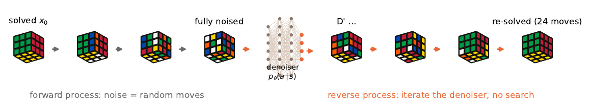
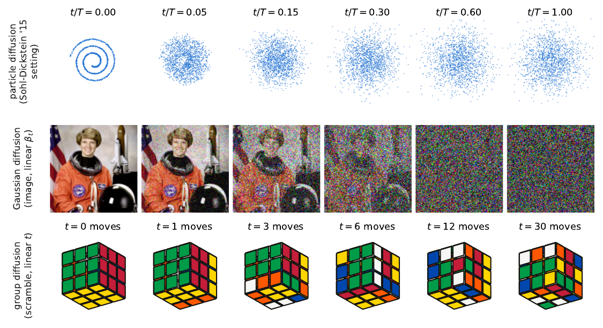
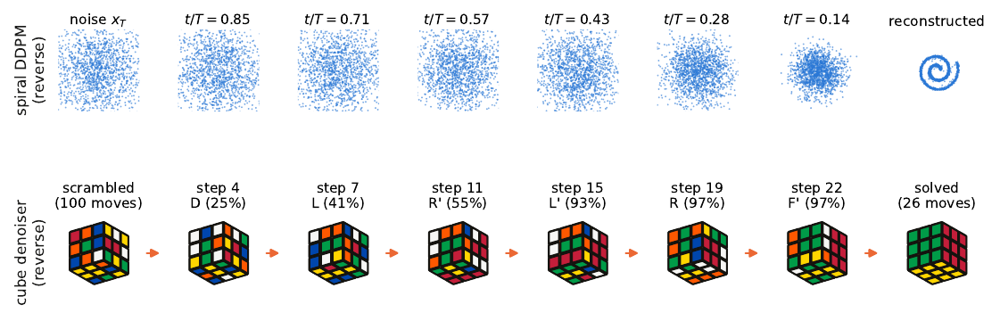
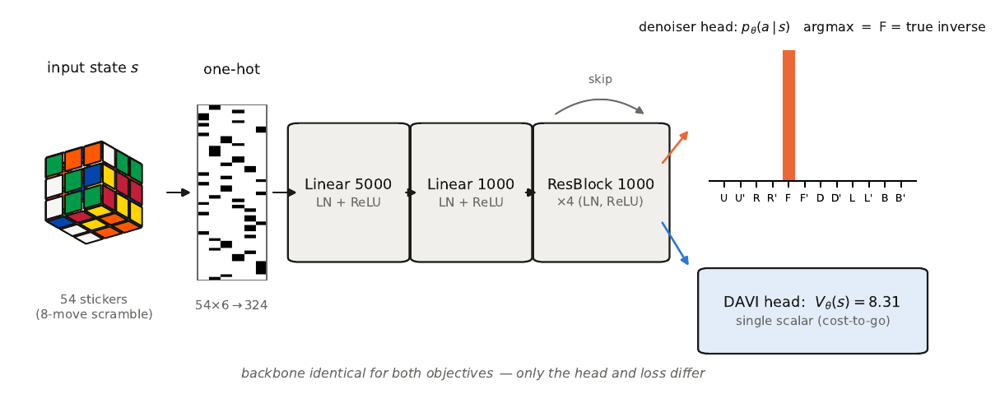
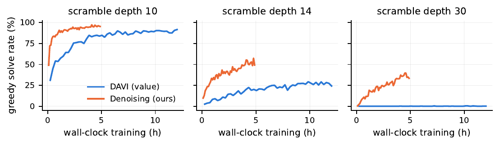
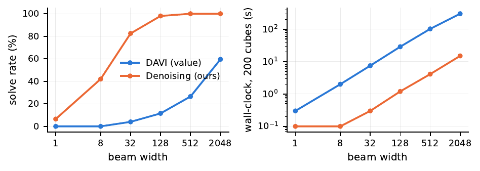
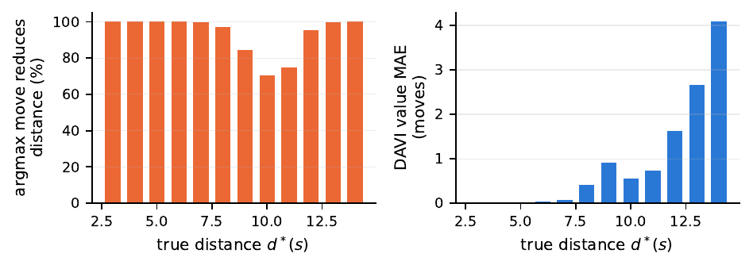
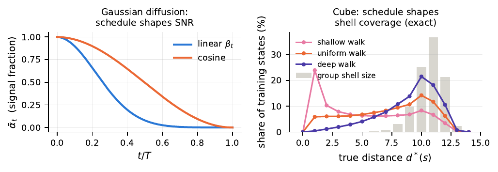

# rubiks-diffusion — cube solving as discrete denoising diffusion

Companion code for the paper *"Scramble Inversion as Discrete Denoising
Diffusion: A Matched-Compute Study on the Rubik's Cube Group"*
([`paper/scramble-inversion-diffusion.pdf`](paper/scramble-inversion-diffusion.pdf)).

Two learned solvers trained and compared under matched compute on one RTX 5080
Laptop GPU, with exhaustive exact-oracle validation:

| | DAVI (value iteration) | Denoising (diffusion-style) |
|---|---|---|
| 2x2: all 3,674,160 states solved | 100% (26 min train) | 100% (6.5 min train), 99.989% greedy-only |
| 3x3: 1000 hundred-move scrambles | 1000/1000 (13.9 h train) | 1000/1000 (4.9 h train), 349 with no search |

Every solution is replay-verified in the environment.

## Vectorized GPU cube engine (2x2 + 3x3)

Reinforcement-learning cube solver trained from scratch on a single RTX 5080 Laptop GPU.
Massively parallel cube simulation in pure torch: every face turn is a fixed permutation
of sticker indices, so stepping N cubes is one `gather` kernel (billions of moves/sec).

## Approach

- **Engine** (`cube_env.py`): `[B, S]` int8 sticker states, move tables generated
  geometrically (rotate sticker positions/normals, re-match) — no hand-typed cycles.
  2x2 uses U/R/F quarter turns only (fixes the DLB corner: unique solved state,
  exactly 7!·3^6 = 3,674,160 reachable states). 3x3 uses all 12 quarter turns.
- **Learning** (`davi.py`, `model.py`): DAVI — deep approximate value iteration
  (DeepCubeA-style). Cost-to-go net V(s) trained on reverse scrambles with targets
  `y(s) = 1 + min_a V_target(step(s,a))`; target net syncs when loss < 0.05.
- **Solving** (`solve.py`): batched greedy descent on V + batched beam search.
  **Every solution is replay-verified** by re-applying the recorded moves in the
  environment and requiring exact arrival at the solved state.
- **Exact oracle** (`bfs_2x2.py`): full-state-space GPU BFS for the 2x2
  (3,674,160 states, QTM diameter 14, 0.6 s) — validates both the engine
  (state count matches group order) and the learned value function.

## Files

| file | purpose |
|---|---|
| `cube_env.py` | vectorized env, move-table generation, pack/unpack |
| `test_env.py` | engine tests: move order 4, inverses, sexy-move order 6, (R U) order 105, chirality |
| `bfs_2x2.py` | exact 2x2 distance oracle (full BFS) |
| `model.py` | residual MLP value net (LayerNorm variant of DeepCubeA arch) |
| `davi.py` | DAVI trainer (`--preset 2x2` / `--preset 3x3`) |
| `solve.py` | greedy / beam / batched-beam solvers + replay verification |
| `eval_2x2.py` | full validation vs oracle (all 3,674,160 states) |
| `eval_3x3.py` | solve-rate eval on fully scrambled 3x3 cubes |
| `bench.py` | engine throughput benchmark |
| `viz_traces.py`, `make_viz.py`, `viz_template.html` | interactive visualizer (3D playback + telemetry) |

## Reproduce

```bash
PY=~/miniconda3/envs/pytorch_r8/bin/python
$PY test_env.py                                   # engine tests
$PY bfs_2x2.py                                    # exact oracle (seconds)
$PY davi.py --preset 2x2 --out runs/2x2_v1        # ~13 min on 5080 Laptop
$PY eval_2x2.py --ckpt runs/2x2_v1/ckpt_latest.pt --out runs/2x2_v1/eval_report.json
$PY davi.py --preset 3x3 --out runs/3x3_v1        # hours (checkpoints + resume)
$PY eval_3x3.py --ckpt runs/3x3_v1/ckpt_latest.pt --out runs/3x3_v1/eval_report.json
$PY make_viz.py --traces2 ... --metrics2 ...      # build viz/index.html
```

---

# The Paper

**Scramble Inversion as Discrete Denoising Diffusion: A Matched-Compute Study on the Rubik's Cube Group**
Aamer Khani · August 2026 · [full PDF](paper/scramble-inversion-diffusion.pdf)



## Abstract

Solving the Rubik's Cube with learned heuristics is conventionally framed as
reinforcement learning: deep approximate value iteration (DAVI) learns a
cost-to-go function that guides search, as in DeepCubeA. We study an
alternative framing in which cube solving is *discrete denoising diffusion on
a Cayley graph*: the forward (noising) process scrambles the solved state with
random generator moves under a linear depth schedule, and a denoiser is
trained by cross-entropy to predict the inverse of the last scramble move —
the exact analogue of ε-prediction. Solving is reverse-process sampling,
optionally sharpened by beam search. The training objective coincides with the
self-supervised scramble-inversion objective of Takano (2023); our
contributions are the diffusion-process formalization, a controlled
matched-architecture, matched-hardware comparison against DAVI, and an
evaluation protocol with unusually strong guarantees: an exact
breadth-first-search oracle over the *entire* 2×2×2 group (3,674,160 states)
and mechanical replay verification of every claimed solution. On a single
consumer GPU, the denoising objective is 5× cheaper per iteration than DAVI,
reaches 99.989% greedy (search-free) solve rate over the full 2×2×2 state
space where DAVI reaches 77.7%, and solves 1000/1000 fully scrambled 3×3×3
cubes after 4.9 hours of training versus 13.9 hours for DAVI at the same
solve rate. Exact-oracle diagnostics reveal complementary error structure:
the value function degrades monotonically with distance-to-goal, while the
denoiser's per-move accuracy dips precisely where the scramble-length
posterior is most ambiguous. Ablations over the noise schedule and timestep
conditioning support the diffusion interpretation: a linear (uniform)
schedule suffices, and conditioning on the timestep is unnecessary because
the group state determines its own noise level.

## The forward process, three state spaces



## The reverse process reconstructs the data

A small DDPM trained on the classic spiral density, above the cube denoiser's
actual greedy rollout (replay-verified):



## Architecture (real forward pass)



## Headline results

**2×2×2 — exhaustive, all 3,674,160 states, replay-verified:**

| | DAVI (value) | Denoising (ours) |
|---|---|---|
| Training wall clock | 26 min | **6.5 min** |
| Greedy solve rate (all states) | 77.67% | **99.989%** |
| Beam solve rate (all states) | 100% (width ≤32,768) | **100% (width 32)** |
| Avg length vs exact optimal | 15.05 (10.52) | **11.59** (10.67) |

**3×3×3 — 1000 hundred-move scrambles, replay-verified:**

| | DAVI 250k iters | Denoising 250k (matched) | Denoising 500k |
|---|---|---|---|
| Wall clock | 13.9 h | **2.4 h** | 4.9 h |
| Solve rate (beam 2048) | 100% | 100% | 100% |
| Greedy-only solve rate | 0% | 25.7% | **34.9%** |
| Avg solution length | **22.95** | 29.02 | 29.88 |

**Training efficiency and test-time compute scaling:**




**Exact error structure (2×2×2 oracle) and schedule semantics:**




## Citation

```bibtex
@article{khani2026scramble,
  title  = {Scramble Inversion as Discrete Denoising Diffusion:
            A Matched-Compute Study on the Rubik's Cube Group},
  author = {Khani, Aamer},
  year   = {2026},
  note   = {\url{https://github.com/aamirkhani/rubiks-diffusion}}
}
```
